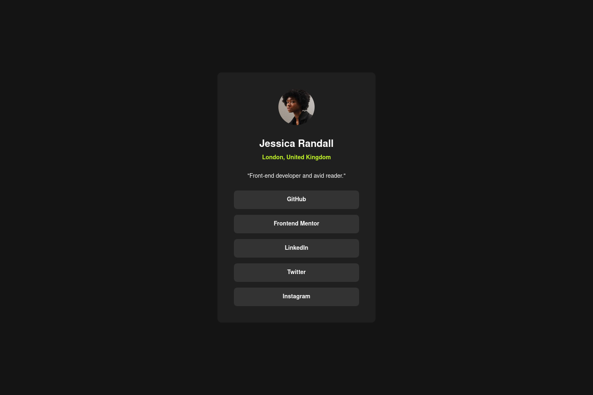

# Frontend Mentor - Social links profile solution

This is a solution to the [Social links profile challenge on Frontend Mentor](https://www.frontendmentor.io/challenges/social-links-profile-UG32l9m6dQ). Frontend Mentor challenges help you improve your coding skills by building realistic projects.

## Table of contents

- [Overview](#overview)
  - [The challenge](#the-challenge)
  - [Screenshot](#screenshot)
  - [Links](#links)
- [My process](#my-process)
  - [Built with](#built-with)
- [Author](#author)

## Overview

### The challenge

Users should be able to:

- [x] See hover and focus states for all interactive elements on the page

### Screenshot

### Links

- Solution URL: https://www.frontendmentor.io/solutions/responsive-social-links-profile-with-fluid-spacing-OLs8qGUOat
- Live Site URL: https://joshjavier.github.io/social-links-profile/

## My process

### Built with

- Semantic HTML5 markup
- CSS custom properties
- [CUBE CSS](https://cube.fyi/)
- [Utopia clamp calculator](https://utopia.fyi/clamp/calculator) for fluid spacing
- [google webfonts helper](https://gwfh.mranftl.com/) for the Inter `.woff2` files

## Author

- GitHub - [@joshjavier](https://github.com/joshjavier/)
- Frontend Mentor - [@joshjavier](https://www.frontendmentor.io/profile/joshjavier)
